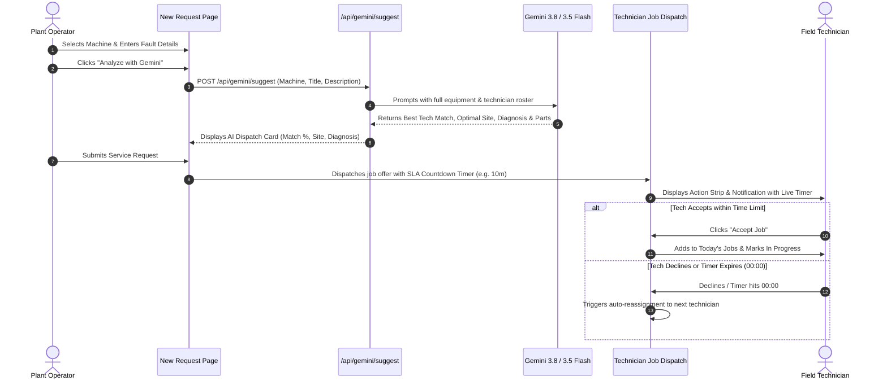

# ServiceSync (Vixen) — DataQuest 3.0

> **Intelligent Industrial Equipment Maintenance & Technician Dispatch Platform**  
> *Built for DataQuest 3.0* | Repository: [github.com/KanuKaushal/dataquest-3.0](https://github.com/KanuKaushal/dataquest-3.0)

---

## 📌 Executive Summary

**ServiceSync** (internally *Vixen*) is a modern, high-precision industrial service tracking and technician dispatch system. Designed for manufacturing plants, heavy machinery facilities, and multi-site industrial ecosystems, ServiceSync bridges the gap between **Plant Operators** managing machine downtime and **Field Technicians** executing SLA-critical repairs.

The platform integrates **Google Gemini AI** for automatic technician skill-matching, equipment failure diagnosis, and site location recommendations, paired with a **Time-Limited Dispatch Engine** that enforces response time limits to prevent stalled maintenance tickets.

---

## ✨ Key Features

### 1. 🤖 Gemini AI Smart Dispatch & Diagnostics
* **Intelligent Technician Matching:** Analyzes equipment type, reported symptoms, and fault category against the field roster (skills, home site, and real-time availability) to compute match scores (up to 99%) and engineering rationales.
* **Site Location Optimization:** Identifies the optimal repair base or physical site (Site A, Site B, Site C) based on asset registries and technician proximity.
* **Predictive Diagnosis & Inventory Packing:** Evaluates fault descriptions to suggest root causes and recommends inventory parts (e.g., *Bearing 6205*, *Seal kit SK-14*) before technicians arrive on site.
* **Model Resilience Cascade:** Powered by `@google/genai` utilizing `gemini-3.8-flash` with automatic fallback to `gemini-3.5-flash-lite` and deterministic heuristics.

### 2. ⏱️ Time-Limited Dispatch & Acceptance Timers
* **SLA-Driven Response Windows:** Every dispatched service request includes an active countdown timer tailored to priority:
  * **Urgent:** 5 minutes
  * **High:** 10 minutes
  * **Medium:** 15 minutes
  * **Low:** 30 minutes
* **Dual-View Countdown:**
  * **Action Strip Banner:** Pinned at the top of the technician portal with live countdown (`mm:ss`) and pulsing urgent alerts when under 5 minutes.
  * **Interactive Notification Window:** Clickable notification cards featuring real-time timers and direct **Accept** and **Decline** actions.
* **Auto-Reassignment Engine:** If a technician declines or the timer expires, the ticket is instantly flagged as reassigned to the next available technician, preserving plant uptime.

### 3. 👥 Dual-Role Architecture
* **Plant Operator / User Portal (`/user/*`):**
  * Live status overview (Open, In Progress, Completed, Overdue).
  * Multi-step service request creation with real-time pre-checks for machine warranty, site coverage, and spare parts stock.
  * AI Copilot integration for automatic skill selection.
* **Field Technician Portal (`/technician/*`):**
  * Schedule and "Today's jobs" board with one-click **Start** and **Mark Complete** transitions.
  * Three-state duty toggle: **Available**, **On a Job**, and **Off Duty**.
  * Notification center with tabs for Unread, Assignments, and Alerts.

### 4. 🔐 Supabase Cloud Authentication & Data Layer
* **Role-Based Access Control:** Distinct `user` and `technician` roles enforced at database level with PostgreSQL enums.
* **Google OAuth & Passwordless Sign-In:** One-click enterprise authentication with automatic profile provisioning via PostgreSQL database triggers (`handle_new_user`).
* **Row-Level Security (RLS):** Strict multi-tenant access control policies.

### 5. 🎨 Bespoke Editorial Design System
* **Crafted Aesthetics:** Warm off-white (`#F7F5F0`), deep ink (`#1A1A18`), and purposeful burnt orange accent (`#E8590C`).
* **Typography:** *Instrument Serif* for editorial headings, *Instrument Sans* for UI elements, and *JetBrains Mono* for IDs and timestamps.
* **Micro-Interactions:** Custom layout animations, self-drawing completion icons, and fluid page transitions built with Framer Motion.

---

## 🛠️ Technology Stack

| Layer | Technologies |
|---|---|
| **Framework** | [Next.js 16](https://nextjs.org/) (App Router, Turbopack) |
| **Language** | [TypeScript 5.7](https://www.typescriptlang.org/) & React 19 |
| **Artificial Intelligence** | [Google Gemini API](https://ai.google.dev/) (`@google/genai` SDK, `gemini-3.8-flash`, `gemini-3.5-flash-lite`) |
| **Database & Auth** | [Supabase](https://supabase.com/) (PostgreSQL, Row-Level Security, Auth) |
| **Styling** | [Tailwind CSS v4](https://tailwindcss.com/) & [shadcn/ui](https://ui.shadcn.com/) |
| **Motion** | [Framer Motion](https://www.framer.com/motion/) |
| **Icons** | [Lucide React](https://lucide.dev/) |

---

## 🔄 System Architecture & Workflows

### Service Request & AI Dispatch Flow



---

## 📂 Project Structure

```text
dataquest-3.0/
├── vixen-landing-page-design/       # Primary Next.js Web Application
│   ├── app/
│   │   ├── api/
│   │   │   └── gemini/
│   │   │       └── suggest/        # Gemini AI dispatch & diagnostic API route
│   │   ├── auth/
│   │   │   └── callback/           # Supabase OAuth redirect handler
│   │   ├── sign-in/                # Sign-in portal (Email & Google OAuth)
│   │   ├── sign-up/                # User registration portal
│   │   ├── technician-sign-up/     # Dedicated technician onboarding
│   │   ├── user/
│   │   │   ├── dashboard/          # Operator metrics & recent requests
│   │   │   ├── new-request/        # Multi-step request form + Gemini AI Advisor
│   │   │   └── notifications/      # Plant operator alerts feed
│   │   └── technician/
│   │       ├── dashboard/          # Active jobs, task logs & status toggle
│   │       ├── notifications/      # Timed job offers & acceptance feeds
│   │       └── schedule/           # Shift & maintenance calendar
│   ├── components/
│   │   ├── new-request/
│   │   │   ├── gemini-advisor.tsx  # Gemini Smart Dispatch UI widget
│   │   │   ├── pre-checks.tsx      # Inventory, site & machine eligibility checks
│   │   │   └── new-request-form.tsx# Request builder
│   │   ├── technician-notifications/
│   │   │   ├── action-strip.tsx    # Live countdown acceptance banner
│   │   │   ├── row-detail.tsx      # In-card response timer & decline modal
│   │   │   └── technician-notification-list.tsx
│   │   ├── ui/                     # Reusable design system primitives
│   │   └── app-shell.tsx           # Responsive layout & navigation
│   ├── lib/
│   │   ├── technician-job-storage.ts # Reactive storage for timed job offers
│   │   ├── technician-notifications.ts
│   │   ├── mock-data.ts            # Machine registry, parts & tech roster
│   │   └── supabase/               # Supabase SSR and browser clients
│   ├── supabase/
│   │   └── schema.sql              # PostgreSQL schemas, RLS policies & triggers
│   └── .env.local                  # Environment credentials
└── README.md
```

---

## 🚀 Getting Started

### Prerequisites
* **Node.js**: v18.18 or higher (v20+ recommended)
* **npm** or **pnpm**
* Supabase Account & Project
* Google Gemini API Key (from Google AI Studio)

### 1. Clone the Repository
```bash
git clone https://github.com/KanuKaushal/dataquest-3.0.git
cd dataquest-3.0/vixen-landing-page-design
```

### 2. Install Dependencies
```bash
npm install
```

### 3. Configure Environment Variables
Create a `.env.local` file in `vixen-landing-page-design/`:

```env
# Supabase Configuration
NEXT_PUBLIC_SUPABASE_URL=https://your-project.supabase.co
NEXT_PUBLIC_SUPABASE_ANON_KEY=your-supabase-anon-key

# Optional: Google Client ID
NEXT_PUBLIC_GOOGLE_CLIENT_ID=your-google-client-id

# Google Gemini API Configuration
GEMINI_API_KEY=your-gemini-api-key
```

### 4. Setup Supabase Database
In your **Supabase Dashboard** $\rightarrow$ **SQL Editor**, execute the migration script located in [`supabase/schema.sql`](supabase/schema.sql):

```sql
-- Role Enum
create type public.user_role as enum ('user', 'technician');

-- User Profiles Table
create table public.profiles (
  id uuid references auth.users on delete cascade primary key,
  email text not null,
  full_name text not null,
  role public.user_role default 'user'::public.user_role not null,
  created_at timestamp with time zone default timezone('utc'::text, now()) not null
);

-- Auto-provision Profile on Auth Sign-Up
create or replace function public.handle_new_user()
returns trigger
language plpgsql
security definer
set search_path = public
as $$
begin
  insert into public.profiles (id, email, full_name, role)
  values (
    new.id,
    coalesce(new.email, ''),
    coalesce(new.raw_user_meta_data->>'full_name', 'User'),
    coalesce((new.raw_user_meta_data->>'role')::public.user_role, 'user'::public.user_role)
  )
  on conflict (id) do nothing;
  return new;
end;
$$;

create trigger on_auth_user_created
  after insert on auth.users
  for each row execute procedure public.handle_new_user();
```

### 5. Run Development Server
```bash
npm run dev
```

Open [http://localhost:3000](http://localhost:3000) to view the application.

---

## 🧪 Testing the Core Flows

| Flow | URL | What to verify |
|---|---|---|
| **Plant Operator Dashboard** | `/user/dashboard` | View live machine health metrics, overdue jobs, and recent equipment logs. |
| **Gemini AI Matching** | `/user/new-request` | Select a machine (e.g. `M-104`), type a fault, and click **"Analyze"** to see Gemini return the optimal technician, match score, site location, and recommended spare parts. |
| **Timed Dispatch Verification** | Submit form & go to `/technician/notifications` | Verify that the newly created ticket appears in the technician notifications with an active ticking countdown timer (`09:59` $\rightarrow$ `00:00`) and test **Accept** or **Decline**. |
| **Technician Schedule** | `/technician/dashboard` | Verify accepted jobs appear under **Today's jobs** and can be toggled through `Start` and `Mark complete`. |

---

## 🛡️ License & Acknowledgments

* **Competition:** Developed for **DataQuest 3.0**.
* **Repository:** [dataquest-3.0](https://github.com/KanuKaushal/dataquest-3.0)
* **Author:** Kanu Kaushal & Team.
